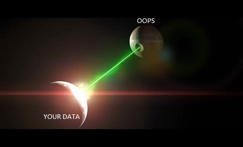

# Destructive SQL Commands
Welcome to the darkside of SQL! This tutorial will teach you how to correctly use the **DELETE**, **DROP**, and **UPDATE** commands - as well as how you can use them incorrectly to the demise of your data. If you're not careful, these three commands can destroy your data's integrity. In this tutorial, we will discuss their syntax, symantics, correct usage, and destructive usage.



## INTRO
Before starting this tutorial please have some familiarity with SQL and how to use it in a Read-Eval-Print-Loop (REPL). In this tutorial, we will be using sqlite3 in a terminal shell environment to work with our commands. In order for you to follow along, you will need to run [this script](./scripts/BankAccounts.sql) before our example problems unless otherwise stated. This script will create a very simple database modeling Bank Accounts. It has one table called **AccountOwners**, containing a Name and AccountNumber attribute in each entry, and a second table called **Accounts** contains an AccountNumber and Balance in each entry.

Run the script (rebuild the database) using:  
`> .read <script_path>`  

After running the prerequisite script, look at the schema and verify that both tables have been created with the appropriate attributes:  
`> .schema`  
    
Now select all the values from both AccountOwners and Accounts:  
`> select * from AccountOwners;`  
`> select * from Accounts;`  
    
We should see the following values:  

## AccountOwners:

Name | AccountNumber
--- | ---
Andy | 10031
Bill | 10004
Carol | 10018

## Accounts:
    
AccountNumber | Balance
--- | ---
10031 | 25000.42
10004 | 100.00
10018 | 30500.50
    
Now we are ready to learn how to use the **DELETE**, **DROP**, and **UPDATE** commands. Remember, if you get lost or break something (it's ok, experimentation is good!) just run the prerequisite script to give yourself a clean slate.

    

## DELETE
#### Overview
 The `DELETE` statement, as you might have guessed, allows you to remove records from a specified table within a database.  There are many reasons you might use the `DELETE` statement on a table, whether that be needing to remove a 
 record that no longer needs to be stored specifically, or remove multiple entries based off some desired condition.
 
#### Syntax
 
 When using the `DELETE` Statement you simply start a line with `DELETE`, and specify the name of the table you would like to remove a record from followed by a `WHERE` condition to specify what record(s) you would like to delete.
 Below are a couple examples using `DELETE` on the tables from our bankAccounts database. 
 
##### Example 1: Removing Bill from the AccountOwners table because he is no longer a member of the bank:
 
```sql
SELECT * from AccountOwners;
```
 
This output should look something like this:

Name  | AccountNumber
  --- | ---
Andy  | 10031
Bill  | 10004
Carol | 10018

Now when we remove Bill with the following line, the output will look like below:
```sql
DELETE FROM AccountOwners WHERE name = "Bill";
```
 
Name  | AccountNumber
  --- | ---
Andy  | 10031
Carol | 10018

##### Example 2: Removing all accounts from Accounts with a balance greater than $800.
```sql
SELECT * from Accounts;
```
This output should look something like this:

 AccountNumber | Balance
--- | ---
10031 | 25000.42
10004 | 100.00
10018 | 30500.50

```sql
DELETE FROM Accounts WHERE balance >= 800;
```

Now when we remove all accounts with the following line, the output will look empty like below:

 AccountNumber | Balance
| --- | --- |
 |||
 |||

#### Incorrect Usage
 While extremely useful, `DELETE` is a powerful statement in that it completely removes any record's specified by the `WHERE` condition, as as such you must be careful to not cause irreparable damage to your database. Below are a few examples of ways you could damage your database through incorrect usage of the `DELETE` statement.
 
##### Example 1: Not specifying a `WHERE` condition and deleting all records from a table.
```sql
DELETE FROM Accounts;
```
##### Example 2: Removing an entry from one table that is referenced from another table using a join.
Suppose we remove Carol's (AccountNumber 10018) record from Accounts, but not AccountOwners.

```sql
DELETE FROM Accounts WHERE AccountNumber = 10018;
``` 

If you were to try and run a query finding Carol's balance by her name you would need to join Accounts and AccountOwner's, however Carol's record has been removed from Accounts and the query will return nothing.

```sql
SELECT balance FROM Accounts inner join AccountOwners O ON accounts.accountnumber = O.accountnumber WHERE name = "Carol";
```

#### Correct Usage
As seen in example 1 of incorrect usage, it is important to be careful before entering a `DELETE` statement so as to not mistakenly purge all records in a table, and ensure you have entered in a proper `WHERE` statement that meets the condition you desire to remove.

Likewise, to maintain referential integrity within our data, it's important not to delete records from one table that corresponds with a record in a different table- as seen in incorrect usage example 2. In cases like this, it is important to either delete all records from all tables pertaining to that particular portion of data, or to retain it so as not to break any references.

#### Summary
The `DELETE` statement is a very useful tool to remove records fitting some condition from a table. Being a powerful statement, you must be careful when using it to not accidentaly compromise the referential integrity of your database, accidentally remove a record, or purge a table all together.

## DROP
#### Overview
The `DROP` command is used for deleting entities within the database (or the database itself). SQLite supports only the `DROP TABLE` command, which removes a table and all of its data from the schema. The `DROP TABLE` statement irreversibly deletes the specified table and cannot be undone. Use utmost caution with this command.
#### Syntax

```sql
DROP TABLE [IF EXISTS] [schema_name.]table_name;
```

#### Incorrect Usage
The `DROP TABLE` command will raise an error if the table to delete does not exist, unless the `IF EXISTS` option is not invoked. Also note that if dropping a table from a specific database, one must include the schema name when referencing the table. Additionally, if a value in the dropped table is referenced as a foreign key in another table, `DROP TABLE` will fail for violating the foreign key constraint. In this case, the foreign key constraint must be disabled before the `DROP` action can be performed. Afterwards, the foreign key values in the remaining table(s) should be set to `NULL` and the foreign key constraint should be enabled again.
 
#### Correct Usage
##### Example: Dropping the accounts
```sql
PRAGMA foreign_keys = OFF;
```

```sql
DROP TABLE Accounts;
```

```sql
UPDATE AccountOwners SET AccountNumber = NULL;
```

```sql
PRAGMA foreign_keys = ON;`
```


#### Review
As this command deletes entire tables from a schema, it has the potential to be quite destructive. Be careful to delete tables from the correct database, and not to leave dangling references to the dropped table in the surviving tables. 

## UPDATE
#### Overview
Like most other SQL commands, `UPDATE` does pretty much what it says. It allows you to modify existing values in a database, either replacing those values completely or modifying what is in there already.

#### Syntax
Let's look at this sample statement to get a feel for how it works:
```sql
UPDATE Accounts SET Balance = 10;
```
This has all the ingredients needed for an `UPDATE` statement. It has the name of the table we're working with, `Accounts`, the column we're changing the value of, `Balance`, and the value we're setting it to, `10`.

Now let's take a look at a more complex example:
```sql
UPDATE Accounts SET Balance = Balance + 40 WHERE AccountNumber = 10031;
```
This example is somewhat more involved, so let's go over the different parts. It has the table and column just like before, but now instead of setting `Balance` to a specific number, it's being set to the value of the previous balance plus 40. It also now has a `WHERE` clause, which will limit the effects of the command to only the rows that match `AccountNumber = 10031`, like how `WHERE` works with a `SELECT` statement.

#### Practice
Let's write a simple command to help get a feel for how this works. Write a query that subtracts $300 from Carol's account.

#### Incorrect Usage
There are two common ways that an `UPDATE` can go wrong.

##### Example 1: Not specifying a `WHERE` condition and modifying all records in the table
The first way is similar to how `DELETE` can go wrong, by just leaving off the `WHERE` clause. This will cause all the values in the column to be either set or modified in the same way, which could be bad if you wanted to set a value for only a single row. Take, for example, this statement:
```sql
UPDATE Accounts SET Balance = Balance - 10;
```
If this statment was intended to represent somebody paying $10 for something, the lack of a `WHERE` clause made it so that every person in the database just became $10 poorer.

#### Example 2: Setting the incorrect value
The other way that an `UPDATE` can cause issues is if the value being set is incorrect. Take the following statement for example:
```sql
UPDATE Accounts SET Balance = AccountNumber - 10 WHERE AccountNumber = 10004;
```
Here, this statement accidentally sets the `Balance` to 10 fewer than the `AccountNumber`, rather than basing it off the balance. This means that if this runs, instead of paying $10 and ending up with $10 fewer, the account owner will end up with $10 fewer than their account number. Obviously, this isn't the intended behavior.

#### Correct Usage
In our first example of an incorrect `UPDATE` statement, the lack of a `WHERE` clause meant that every account was affected, not just the one we wanted. The fix here is simple: we just need to add that `WHERE` in.
```sql
UPDATE Accounts SET Balance = Balance - 10 WHERE AccountNumber = 10018;
```

In the second example, we're setting the correct account's `Balance` to the wrong value. If we amend the statement and instead do the correct calculation, we can get the intended result.
```sql
UPDATE Accounts SET Balance = Balance - 10 WHERE AccountNumber = 10004;
```

#### Review
The `UPDATE` command is often needed to make changes to one or more entries in a database, but using it incorrectly it can lead to some confusing results. Like with all commands which have the potential to modify the database, it's important to make sure all of your statements are constructed correctly before running them.

## Further Reading
Now you should understand the good and the bad of `DELETE`, `DROP`, and `UPDATE`. If you would like more detailed information, please see the [DELETE](https://dev.mysql.com/doc/refman/8.0/en/delete.html), [DROP](https://dev.mysql.com/doc/refman/8.0/en/drop-table.html), and [UPDATE](https://dev.mysql.com/doc/refman/8.0/en/update.html) documentation pages by MySQL.  
If you enojyed the tutorial format, W3 has schools has many good tutorials on SQL [here](https://www.w3schools.com/sql/).
